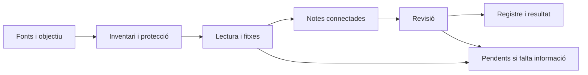

# Com funciona Garbell

Garbell és un projecte centrat en **una skill**. L'agent d'IA que ja utilitzes
llegeix les instruccions i treballa sobre els fitxers de la volta. El projecte
hi afegeix referències, eines auxiliars, documentació i exemples. Per a l'ús
habitual, un únic agent pot fer tot el procés.

## Qui fa què

| Peça | Responsabilitat | Com intervé |
|---|---|---|
| Usuari | Aporta fonts, objectiu i destinació; revisa els resultats | Demana crear, ampliar, consultar o mantenir la volta |
| Agent d'IA | Llegeix, interpreta, escriu i utilitza les eines disponibles | Executa la petició seguint la skill |
| `skills/garbell/SKILL.md` | Defineix el procediment i els criteris | És l'entrada de la skill `$garbell` |
| `skills/garbell/references/` | Desenvolupa esquemes i procediments específics | L'agent consulta les referències que demana l'operació |
| `skills/garbell/scripts/` | Inventari, empremtes i comprovacions opcionals | L'agent executa Python si el mode i l'entorn ho permeten |
| `agents/` del projecte | Descriu rols opcionals de coordinació i revisió | S'utilitzen quan s'ha demanat aquest repartiment de feina |
| `skills/garbell/agents/openai.yaml` | Metadades de presentació de la skill en Codex | Actualment conté nom visible, descripció breu i petició suggerida |
| `AGENTS.md` | Instruccions contextuals per treballar al projecte o a la volta | No és un agent executable |
| Obsidian | Mostra i permet editar notes, enllaços i graf | Obre la carpeta de la volta generada |

La carpeta interna `agents/` respon a la convenció de metadades de Codex.
El fitxer `openai.yaml` actual no defineix un coordinador ni un revisor.
[Documentació oficial de skills](https://developers.openai.com/codex/skills).
Els fitxers de rols de l'arrel són guies de treball portables; el repositori
no inclou un servei que arrenqui dos agents ni un sistema de delegació automàtica.

## Les operacions de la skill

| Petició | Operació | Resultat |
|---|---|---|
| «Crea una volta amb aquesta carpeta» | Preparar + incorporar | Estructura inicial, fitxes, connexions i registre |
| «He afegit documents» | Incorporar o actualitzar | Noves fonts integrades i notes afectades revisades |
| «Què diuen les fonts sobre…?» | Consultar | Resposta amb fonts i localitzadors; no reescriu la volta per defecte |
| «Revisa l'estat de la volta» | Mantenir | Enllaços, dependències, conflictes i pendents revisats |

Són operacions que l'agent tria segons la petició, no comandaments que l'usuari
hagi de memoritzar. S'hi reconeix la idea de passos de WikiForge: preparació,
ingestió, consulta i manteniment. La incorporació conserva un ordre de treball;
no cal convertir cada pas en un agent diferent. La fusió entre voltes no és
una operació automatitzada específica d'aquest projecte.

## Incorporar documents, pas a pas

1. **Situar la tasca.** Identificar fonts, volta, objectiu i configuració.
   Respectar l'organització existent; en una volta nova, triar categories a
   partir del contingut. Una lectura de mostra només serveix per orientar-la.
2. **Inventariar.** Detectar entrades noves, modificades i pendents. Amb Python,
   `scan` compara empremtes; en manual, l'agent enumera fitxers i consulta el
   registre, rellegint quan no pot demostrar que el contingut és igual.
3. **Protegir el treball existent.** Garantir un únic escriptor i preparar
   còpies de recuperació abans d'editar. Detectar possibles edicions humanes;
   si no hi ha una base segura, conservar-les i presentar propostes separades.
4. **Llegir i delimitar.** Llegir la font i conservar pàgines, seccions o altres
   localitzadors. Si falten pàgines, OCR o un lector, deixar constància de
   l'abast i dels pendents. Un resum parcial no completa la lectura original.
5. **Crear la fitxa.** Registrar procedència, abast, contingut i límits. Buscar
   identitats existents abans de duplicar. Enllaçar amb els originals.
6. **Integrar i connectar.** Ampliar notes existents o crear conceptes, mètodes, síntesis d’evidència i preguntes de recerca.
   Explicar les relacions amb evidència; revisar també les notes que depenen
   d'una font modificada. No afegir enllaços només per augmentar-ne el nombre.
7. **Revisar.** Comprovar fidelitat, localitzadors, metadades i destins dels
   enllaços. Amb Python, `links` ajuda amb els destins, però no valida
   contingut científic ni totes les propietats de la volta.
8. **Registrar i informar.** Actualitzar índex i registre. Amb Python, executar
   `accept` només per fonts completades i sense conflictes, amb l'empremta
   anterior a la lectura. En manual, registrar lectura i dependències sense
   inventar empremtes. Explicar canvis, pendents i límits a l'usuari.

Aquesta és una explicació del flux, no un programa que s'executi sense un
agent. El detall operatiu es manté a la [skill](../../skills/garbell/SKILL.md)
i les seves referències. La consulta d'una volta existent pot començar per
l'índex i no necessita repetir una ingestió.

## Coordinador i revisor: rols opcionals

El [coordinador](../../agents/coordinator.md) prepara el lot i integra els
canvis com a únic escriptor. El [revisor](../../agents/evidence-reviewer.md) llegeix
les propostes i les fonts, i retorna incidències localitzades. El revisor
no modifica les notes ni marca el resultat com a revisió humana.

La mateixa sessió pot assumir coordinació i després revisió. Aquesta revisió
és una comprovació de la mateixa IA, no una segona opinió independent. Si
l'usuari demana agents separats i l'entorn ho permet, aquests rols poden
servir per repartir la feina: el revisor informa i el coordinador integra.
Els fitxers Markdown sols no creen ni coordinen subagents.

La verificació de contingut és part del procés habitual encara que no s'usi
el rol opcional de revisor. Una revisió addicional consumeix més temps i
context; té sentit per a lots difícils o quan es vol contrastar la primera
lectura. Només una revisió humana explícita permet l'estat `reviewed`.

## Què és opcional

Python ajuda a detectar canvis i comprovar destins; els
[modes de treball](../../skills/garbell/references/tooling.md) defineixen l'alternativa.
Els rols, els exemples i els colors del graf són complements. La programació
periòdica és externa a la skill i només es configura si es demana. Afegir
un document a `raw/` no posa en marxa cap procés per si mateix.
