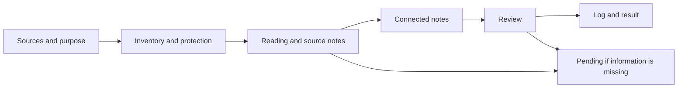

# How Garbell works

[English](workflow.md) · [Català](../ca/funcionament.md)

Garbell is built around **one skill**. Your existing AI agent reads its instructions
and works on the vault files. The project adds references, helper tools,
documentation and examples. One agent can normally perform the entire process.

## Who does what

| Component | Responsibility | How it participates |
|---|---|---|
| User | Supplies sources, purpose and destination; reviews results | Requests creation, expansion, queries or maintenance |
| AI agent | Reads, interprets, writes and uses available tools | Follows the skill to carry out the request |
| `skills/garbell/SKILL.md` | Defines procedure and criteria | Entry point for `$garbell` |
| `skills/garbell/references/` | Details schemas and specific procedures | The agent reads the references required for the operation |
| `skills/garbell/scripts/` | Optional inventory, hashing and checks | The agent runs Python if the mode and environment allow it |
| Project-level `agents/` | Describes optional coordination and review roles | Used when this division of work is requested |
| `skills/garbell/agents/openai.yaml` | Codex skill display metadata | Currently holds display name, short description and suggested prompt |
| `AGENTS.md` | Contextual instructions for the project or vault | Not an executable agent |
| Obsidian | Displays and edits notes, links and graph | Opens the generated vault folder |

The internal `agents/` folder follows Codex's metadata convention. The current
`openai.yaml` does not define a coordinator or reviewer. See the
[official skills documentation](https://developers.openai.com/codex/skills).
The root role files are portable working guides; the repository contains no
service that starts two agents or delegates work automatically.

## Skill operations

| Request | Operation | Result |
|---|---|---|
| “Create a vault from this folder” | Prepare and ingest | Initial structure, source notes, connections and log |
| “I have added documents” | Ingest or update | New sources integrated and affected notes revisited |
| “What do the sources say about…?” | Query | Answer with sources and locators; does not rewrite the vault by default |
| “Review the vault's state” | Maintain | Review of links, dependencies, conflicts and pending work |

The agent selects operations from your request; these are not commands you
need to memorize. The workflow follows WikiForge's idea of preparation,
ingestion, queries and maintenance. Ingestion has an ordered procedure;
each step does not need a separate agent. Merging vaults is not a dedicated
automated operation in this project.

## Ingesting documents, step by step

1. **Establish context.** Identify sources, vault, purpose and configuration.
   Respect existing organization and language settings; see [vault language defaults](languages.md). In a new vault, choose categories from the
   content; sampling only helps orient this choice.
2. **Inventory.** Identify new, changed and pending inputs. With Python,
   `scan` compares hashes. In manual mode, list files and read the log,
   rereading whenever unchanged content cannot be established.
3. **Protect existing work.** Ensure a single writer and prepare recovery
   copies before editing. Detect possible human edits; without a safe baseline,
   preserve them and present separate proposals.
4. **Read and define scope.** Read the source and retain page, section or other
   locators. Record missing pages, OCR or readers and pending work. A partial
   summary does not complete reading of the original.
5. **Create the source note.** Record provenance, scope, content and limits.
   Identify journal, document type, editorial format and version when supported, and maintain corpus catalogues linked from the index. Check existing identities before creating duplicates. Link originals.
6. **Integrate and connect.** Extend existing notes or create concepts, methods, evidence syntheses and research questions.
   Explain relations with evidence and revisit notes depending on changed
   sources. Do not add links merely to increase their number.
7. **Review.** Check fidelity, locators, metadata and link destinations.
   Python's `links` helps with destinations but does not validate scientific
   content or all vault properties.
8. **Record and report.** Update the index and log. With Python, run `accept`
   only for completed, conflict-free sources, using their pre-reading hash.
   In manual mode, record reading and dependencies without inventing hashes.
   Explain changes, pending work and limitations to the user.

This describes a workflow, not a program that runs without an agent.
Operational details remain in the [skill](../../skills/garbell/SKILL.md) and its
references (Catalan). Queries can start from the index without repeating ingestion.

## Coordinator and reviewer: optional roles

The [coordinator](../../agents/coordinator.md) prepares the batch and integrates
changes as the sole writer. The [reviewer](../../agents/evidence-reviewer.md) reads
proposals and sources and reports issues with locations. It does not edit
notes or mark its work as human review. These role files are in Catalan.

One session can coordinate and then review. This is the same AI checking its
work, not an independent second opinion. If the user requests separate agents
and the environment supports them, the roles can divide the work: the reviewer
reports and the coordinator integrates. Markdown files alone do not create
or coordinate subagents.

Content verification is part of the normal process even without the optional
reviewer role. Additional review consumes time and context and may help with
difficult batches or checking an initial reading. Only explicit human review
allows `reviewed` status.

## What is optional

Python helps detect changes and check destinations; the
[working modes](../../skills/garbell/references/tooling.md) define the alternative.
Roles, examples and graph colours are optional additions. Scheduling is external
to the skill and is configured only on request. Adding a document to `raw/`
does not start a process by itself.
